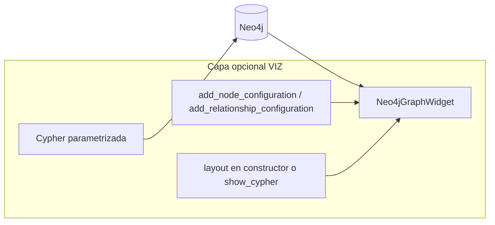

# Skills del Agente para la Cocreación de Ungraph

**Fecha de elaboración:** 2026-04-12
**Basado en:** `ANALYSIS_120426.md` + inspección del árbol de código `ungraph 0.1.5`
**Propósito:** Definir las capacidades que el agente debe dominar para aportar el mayor valor posible en el desarrollo iterativo de esta librería.

---

## Contexto del proyecto

Ungraph es un framework Python para construir **grafos de conocimiento** desde texto no estructurado, persistidos en Neo4j, bajo el patrón **Extract–Transform–Inference (ETI)** con recuperación tipo **GraphRAG**. El núcleo actual (ET + búsqueda + embeddings) es sólido; las brechas prioritarias son tests versionados, CI alineado, contrato público explícito e inferencia estabilizada.

**Plan maestro (lectura recomendada):** [`docs/product/PRODUCT.md`](../docs/product/PRODUCT.md) define finalidad y niveles **A / B / C** en resumen; [`docs/product/VISION_AND_TUTORIALS.md`](../docs/product/VISION_AND_TUTORIALS.md) **§3** desarrolla esos niveles y encaja tutoriales y §8 (aprendizaje del mejor grafo). **Prioridad de entrega:** cerrar y estabilizar **A + B**; **C** solo como horizonte en el plan maestro (mismo criterio en `PRODUCT` y `VISION`).

**Este archivo** es el plan **técnico de ejecución**: skills, prioridades (**§8**) y módulo de visualización (**§7**).

**Checkpoint de desarrollo (inferencia / pipeline):** [`docs/CHECKPOINT_INFERENCE_PIPELINE.md`](../docs/CHECKPOINT_INFERENCE_PIPELINE.md) — estado implementado, rutas de código y próximos pasos para retomar sin depender solo del plan en Cursor.

**Horizonte nivel C (plan maestro, §8):** [`docs/experiment/ROADMAP_LEVEL_C.md`](../docs/experiment/ROADMAP_LEVEL_C.md) — fases C0–C5 (medición, eval–refinar, MCP, recomendación); oleadas H_I / familias Infer.

**Playbook agente (Cursor):** skills en `.claude/skills/` (router `ungraph`, experimental `eti-experiment-science`); subagentes `.cursor/agents/ungraph-dev-skills.md` y `ungraph-eti-science.md`. Checklist vivo: [`docs/experiment/PLAN_MAESTRO.md`](../docs/experiment/PLAN_MAESTRO.md).

---

## 1. Dominio: Grafos de Conocimiento y Neo4j

### 1.1 Modelado de grafos
- Diseño de esquemas de nodos y relaciones para representar entidades, hechos, chunks, documentos y su procedencia (`Provenance`).
- Estrategias de indexado en Neo4j: índices de texto completo (`FULLTEXT`), índices vectoriales (`VECTOR`), índices de propiedad compuesta.
- Gestión de restricciones de unicidad y cardinalidad para grafos de conocimiento limpios (deduplicación de entidades, merges idempotentes).

### 1.2 Cypher avanzado
- Escritura de consultas Cypher complejas: patrones variables-length, `OPTIONAL MATCH`, subqueries (`CALL { … }`), funciones de agregación y proyección.
- Validación y testing de queries Cypher (coherente con `ungraph/scripts/validate_cypher_queries.py`).
- Optimización de planes de ejecución: perfilado con `EXPLAIN` / `PROFILE`, detección de full-graph scans.

### 1.3 Graph Data Science (GDS)
- Proyección de grafos en memoria y uso de algoritmos GDS: PageRank, community detection (Louvain, WCC), Node Similarity, embeddings de grafos (Node2Vec, FastRP).
- Integración del `GDSService` como extra opcional sin romper la superficie mínima de la librería.
- Interpretación de métricas de grafo para enriquecer recuperación y búsqueda semántica.

---

## 2. Python: Arquitectura y Calidad de Código

### 2.1 Clean Architecture / DDD
- Comprensión profunda de la separación `domain / application / infrastructure` que ya usa Ungraph.
- Capacidad de añadir nuevos servicios de dominio o puertos sin contaminar capas internas con dependencias de infraestructura.
- Uso correcto de interfaces abstractas (`ABC`) y factories de dependencias (`application/dependencies.py`).

### 2.2 Tipado estático
- Uso de `mypy` / `pyright` para garantizar contratos de tipos en la API pública.
- Implementación de `py.typed` y estrategia de stubs para que consumidores externos obtengan autocompletado y verificación estática (brecha crítica del análisis).
- Empleo de `TypeVar`, `Protocol`, `Literal`, `TypedDict` donde aportan claridad sin sobreingeniería.

### 2.3 Packaging y publicación
- Configuración precisa de `pyproject.toml`: extras opcionales, marcadores de entorno, `include`/`exclude` de archivos.
- Flujo de build con `uv` / `build` / `twine`; comprensión de los scripts `publish.py`, `check_publish_status.py`, `validate_pyproject.py`.
- Gestión semántica de versiones (semver) y ciclo de deprecación compatible con una hoja de ruta hacia `1.0`.

### 2.4 Testing robusto
- Diseño de suite de tests en tres niveles: **unitarios** (sin Neo4j, mocks de repositorios), **integración** (marcador `integration`, Neo4j real vía Docker), **e2e** (flujo ETI completo).
- Fixtures de pytest reutilizables para grafos de prueba, documentos sintéticos y configuraciones de embedding ligeras.
- Configuración de `pytest.ini` con marcadores, cobertura y umbrales — y comprensión de por qué `tests/` no puede estar en `.gitignore` en un proyecto reproducible (brecha 3.1 del análisis).

---

## 3. NLP, Embeddings e Inferencia

### 3.1 Chunking estratégico
- Conocimiento de estrategias de chunking: tamaño fijo, por oración, jerárquico, semántico (coherente con `suggest_chunking_strategy` y `LangchainChunkingService`).
- Evaluación de trade-offs: tamaño de chunk vs. precisión de recuperación vs. coste de embedding.

### 3.2 Modelos de embedding
- Integración y evaluación de modelos HuggingFace (`HuggingFaceEmbeddingService`): `sentence-transformers`, modelos multilingüe (es/en).
- Comparación de dimensionalidades, normalización de vectores y gestión de índices vectoriales en Neo4j.
- Selección del modelo adecuado según dominio (texto jurídico, científico, conversacional).

### 3.3 Extracción de entidades y relaciones (NLP)
- Uso de spaCy para NER y extracción de relaciones (`SpacyInferenceService`).
- Integración de LLMs para extracción estructurada (`LLMInferenceService`) con salida validada (Pydantic/structured outputs).
- Definición clara de qué modos de inferencia son GA vs. experimentales (brecha 3.4 del análisis).

### 3.4 Patrones GraphRAG
- Diseño e implementación de patrones de búsqueda avanzados: entidad-centrado, path-based, community-aware, temporal.
- Comprensión de `predefined_patterns.py`, `GraphPattern`, `neo4j_pattern_service.py` y `advanced_search_patterns.py`.
- Evaluación de calidad de recuperación: precision@k, recall@k, MRR para búsqueda textual, vectorial e híbrida.

---

## 4. Ciencia de Datos y Extracción de Valor

### 4.1 Análisis de grafos de conocimiento
- Exploración y visualización de grafos: métricas de densidad, grado, centralidad, componentes conectados.
- **Módulo dedicado de visualización** (plan maestro: §7): interfaz estable para inspección rápida en notebooks y exportación; no sustituir por scripts sueltos en el tiempo.
- Identificación de patrones emergentes en el grafo como fuente de insights para el usuario final.

### 4.2 Evaluación de pipelines RAG
- Frameworks de evaluación: RAGAS, TruLens, o evaluaciones ad-hoc con LLM-as-judge.
- Diseño de datasets de evaluación (preguntas + respuestas esperadas) sobre grafos de prueba.
- Trazabilidad de respuestas hasta los nodos fuente en el grafo (provenance).

### 4.3 Análisis de documentos y corpus
- Comprensión de tipos de documento (`DocumentType`): PDF, Markdown, HTML, texto plano.
- Estrategias de limpieza de texto (`SimpleTextCleaningService`) adaptadas a cada tipo de fuente.
- Carga masiva y procesamiento en lote sin saturar Neo4j ni la memoria del proceso.

---

## 5. DevOps y CI/CD para Librerías Python

### 5.1 GitHub Actions
- Configuración de workflows alineados con el layout real del código (`ungraph/`, no `src/`) — corrige la brecha 3.2 del análisis.
- Jobs separados: lint, type-check, tests unitarios, tests de integración con servicio Neo4j, build de wheel, publicación condicional.
- Uso de matrices de versiones Python (3.12+) y caché de dependencias con `uv`.

### 5.2 Calidad de código automatizada
- Configuración de `ruff` (o `flake8`+`isort`+`black`) con reglas coherentes con el estilo del proyecto.
- Pre-commit hooks para que lint y formato corran antes de cada commit.
- Integración con Codecov y definición de umbrales de cobertura mínima por módulo.

---

## 6. Comunicación y Diseño de API Pública

### 6.1 Contrato de API
- Definición explícita de `__all__` en cada módulo público.
- Documentación de qué es estable, experimental o privado (`_prefixed`).
- Política de deprecación con warnings (`DeprecationWarning`) antes de romper cambios.

### 6.2 Documentación técnica
- Escritura de docstrings tipo NumPy/Google con ejemplos ejecutables (`doctest`).
- Mantenimiento del `CHANGELOG` en formato Keep a Changelog para trazabilidad por versión.
- Generación de documentación con MkDocs / Sphinx compatible con el árbol `docs/` existente.

---

## 7. Módulo de visualización (yFiles for Jupyter) y exportación de grafos

**Objetivo:** un **módulo opcional** (p. ej. extra `ungraph[viz]` o paquete hermano documentado) dedicado **únicamente** a **visualización interactiva** y **exportación**, sin acoplar el núcleo ETI/Neo4j a widgets de UI. El backend de verdad sigue siendo Neo4j; la capa de viz consume resultados de consultas Cypher o proyecciones ligeras.

### 7.1 Stack de referencia
- **[yFiles Graphs for Jupyter](https://github.com/yWorks/yfiles-jupyter-graphs)** como widget de visualización en notebooks: layouts, barra lateral de vecindad, datos de nodos/aristas, búsqueda en el grafo renderizado, importación desde estructuras Python habituales (p. ej. listas de nodos/aristas, NetworkX).
- Evaluar **[yfiles-jupyter-graphs-for-neo4j](https://github.com/yWorks/yfiles-jupyter-graphs-for-neo4j)** cuando el flujo sea “conectar al grafo Neo4j cargado” frente a “serializar primero en memoria”; la decisión debe mantener **dependencias opcionales** y versiones pinneadas en extras.

### 7.2 Interfaz pública esperada (contrato de producto)
La interfaz debe exponer métodos claros orientados a **exploración rápida**, no solo un dump de nodos:

| Capacidad | Comportamiento esperado |
|-----------|-------------------------|
| **Vista rápida** | Renderizar un subgrafo ya cargado o resultado de query con **configuraciones predefinidas** (p. ej. por tipo de nodo, por profundidad de vecindad, layout). |
| **Estructura** | Visualizar **jerarquías o patrones** alineados con Ungraph (p. ej. File → Page → Chunk, entidades colgando de chunks) mediante proyecciones Cypher o filtros por etiqueta. |
| **Filtro por documento** | Acotar nodos y relaciones a un **documento o archivo** concreto (id de `File`, ruta, u otro identificador estable en el patrón) para inspeccionar un corpus grande por partes. |
| **Exploración** | API para **ampliar vecindad**, aplicar tope de tamaño, y re-renderizar sin obligar al usuario a escribir Cypher en cada paso (opcionalmente exponer Cypher avanzado). |
| **Configuraciones** | Parámetros nombrados: límites de nodos/aristas, layout, mapeo de color/tamaño por propiedad (p. ej. tipo de entidad, score), modo “solo estructura” vs. “incluir texto resumido”. |

### 7.3 Exportación (`n` formatos)
Exponer métodos de **exportación** reutilizables por CLI, tests y notebooks, priorizando interoperabilidad:

- **Intercambio y análisis:** GraphML, GEXF (Gephi), JSON node-link (D3, observabilidad), lista de aristas / CSV de nodos y relaciones.
- **Ecosistema Python:** serialización a **NetworkX** / **igraph** cuando aporte (p. ej. para GDS local o prototipos).
- **RDF / triples** (opcional, fase posterior): solo si hay demanda clara; no bloquear el MVP de viz.

Los formatos deben documentarse en `docs/` con una tabla “formato → caso de uso → limitaciones”.

### 7.4 Límites y calidad
- **Opcionalidad:** dependencias pesadas (Jupyter, yFiles) **no** en el wheel mínimo; extra opcional documentado en [`pyproject.toml`](../pyproject.toml) como `ynet` (`ungraph[ynet]`). El alias `ungraph[viz]` puede añadirse cuando se quiera alinear el nombre del extra con este §7.
- **Seguridad:** no ejecutar Cypher arbitrario sin pasar por APIs que parametrizan consultas o plantillas revisadas (coherente con ingestión segura).
- **Tests:** pruebas unitarias sobre **serialización y filtros** sin widget; integración ligera opcional con Neo4j de prueba.

### 7.5 Estrategia visual con yFiles for Jupyter

La visualización debe ser **clara antes que vistosa**: pocas decisiones de diseño repetibles (paleta, forma, grosor) y **layouts** elegidos según la pregunta del analista (¿jerarquía de documento?, ¿vecindad?, ¿secuencia de chunks?).

**Paleta minimalista (referencia):** 4–6 colores base para **labels** Neo4j (`Chunk`, `File`, `Entity`, etc.) más un tono neutro para “otros”. Evitar gradientes o escalas de color densas sobre propiedades continuas en vistas de trabajo; reservar eso para demos o una sola dimensión acordada.

**Jerarquía visual:** nodos **más pequeños** donde hay muchos ítems (p. ej. `Chunk`), **más grandes** en anclas (`File`, `Document`). Aristas **finas** por defecto; mayor `thickness_factor` solo en tipos que deben destacar (p. ej. `NEXT_CHUNK`, relaciones de inferencia críticas).

**Formas por rol:** usar `styles.shape` en configuraciones por label (`round-rectangle` para documentos/archivos, `ellipse` para entidades, etc.), según la [API de `add_node_configuration`](https://github.com/yWorks/yfiles-jupyter-graphs-for-neo4j/blob/main/README.md).

**Layouts por caso de uso:**

| Intención | Layouts típicos (widget) |
|-----------|---------------------------|
| Estructura documento (File → Page → Chunk) | `hierarchic`, `tree` |
| Vecindad y exploración libre | `organic`, `interactive_organic` |
| Secuencia o flujo legible | `orthogonal`; cadena explícita con `NEXT_CHUNK` visible |

**Carga cognitiva:** queries plantilla con **límites estrictos** (nodos/aristas); activar **overview** del widget cuando el ancho de celda lo permita (`overview_enabled`). El propio yFiles ofrece barra lateral de datos, búsqueda y vecindad: **no** duplicar esa UI en Python salvo necesidad puntual.

### 7.6 Capacidades técnicas reutilizables

El conector **[yfiles-jupyter-graphs-for-neo4j](https://github.com/yWorks/yfiles-jupyter-graphs-for-neo4j)** expone `Neo4jGraphWidget` sobre el núcleo **[yFiles Graphs for Jupyter](https://github.com/yWorks/yfiles-jupyter-graphs)**. Contrato orientado a presets de VIZ:

- **Constructor:** `Neo4jGraphWidget(driver, layout=..., widget_layout=..., overview_enabled=...)`.
- **Consulta:** `show_cypher(cypher, layout=..., **params)` — preferir Cypher **parametrizada** frente a interpolación de strings en helpers públicos.
- **Estilo por label/tipo:** `add_node_configuration(label, color=..., size=..., styles=..., type=...)` y `add_relationship_configuration(...)` para un “tema Ungraph” reproducible (colores, formas, grosor).
- **Referencias avanzadas:** [ejemplos upstream](https://github.com/yWorks/yfiles-jupyter-graphs/tree/main/examples) (mapeo de color, layouts, sidebar) para patrones que no dependen de Neo4j.

**Relación con el código actual:** en [`ungraph/notebooks/graph_visualization.py`](../ungraph/notebooks/graph_visualization.py) las funciones instancian el widget con query en el constructor. La **dirección recomendada** es `widget = Neo4jGraphWidget(driver)`, aplicar presets con `add_*_configuration`, y luego `show_cypher(...)`; refactorizar los helpers hacia ese flujo es trabajo posterior independiente de este documento.

### 7.7 Mínimo hoy vs. mejor mañana

**Hoy (MVP VIZ):**

| Objetivo | Criterio |
|----------|----------|
| **Instalación opcional** | `pip install ungraph[ynet]` (véase [`pyproject.toml`](../pyproject.toml)); documentar `ungraph[viz]` cuando exista alias del extra. |
| **Una vista fiable** | Subgrafo acotado (LIMIT + filtros por documento) con **un** preset de layout por patrón (p. ej. jerárquico para árbol de chunks). |
| **Identidad visual básica** | Paleta minimalista (hex en notas o código) + `add_node_configuration` para los labels principales del esquema Ungraph. |
| **Exploración en widget** | Aprovechar barra lateral, búsqueda y vecindad de yFiles sin reimplementar UI. |
| **Seguridad** | Queries parametrizadas; no exponer Cypher crudo sin revisión en APIs públicas. |

**Mañana (evolución):**

| Mejora | Valor |
|--------|--------|
| **Módulo `ungraph.viz` (o paquete hermano)** | Presets nombrados (`theme_minimal`, `layout_for_file_chunk_tree`); tests sobre construcción de configuración sin instanciar el widget. |
| **Doble entrada de datos** | Además de Neo4j: NetworkX o listas nodo-arista vía **yfiles-jupyter-graphs** base para prototipos offline o pipelines sin base de datos. |
| **Bindings dinámicos** | Funciones en `color` / `size` según propiedades (p. ej. score) manteniendo la regla de poca saturación cromática. |
| **Agrupación visual** | `parent_configuration` y relaciones padre-hijo para agrupar por documento o sección. |
| **Exportación + viz** | Combinar §7.3 con flujos documentados desde notebook (fragmentos exportables + vista interactiva). |

### 7.8 Relación con el plan de producto

Este módulo satisface historias del tipo: *“Como analista, quiero ver y filtrar el grafo por documento y exportar un fragmento para compartir”*. Marco de producto y prioridades: [`docs/product/PRODUCT.md`](../docs/product/PRODUCT.md).

---

## 8. Prioridades de Aplicación (orden sugerido)

| Prioridad | Skill área | Acción concreta |
|-----------|-----------|-----------------|
| 🔴 Alta | Testing (§2.4) | Versionar `tests/` y eliminar de `.gitignore` |
| 🔴 Alta | CI/CD (§5.1) | Alinear paths de lint con `ungraph/` |
| 🟡 Media | Tipado (§2.2) | Añadir `py.typed` y anotaciones en API pública |
| 🟡 Media | API pública (§6.1) | Definir `__all__`, marcar experimental/estable |
| 🟢 Normal | GraphRAG (§3.4) | Ampliar y evaluar patrones de búsqueda avanzada |
| 🟢 Normal | GDS (§1.3) | Consolidar algoritmos GDS como extra documentado |
| 🟢 Normal | Inferencia (§3.3) | Promover LLMInferenceService de experimental a beta |
| 🟢 Normal | Visualización (§7) | Implementar módulo opcional yFiles + exportación (GraphML, GEXF, JSON, NetworkX, CSV); filtros por documento y presets de layout |

---

*Este documento es un artefacto vivo: debe actualizarse conforme el proyecto avance hacia `1.0`.*
