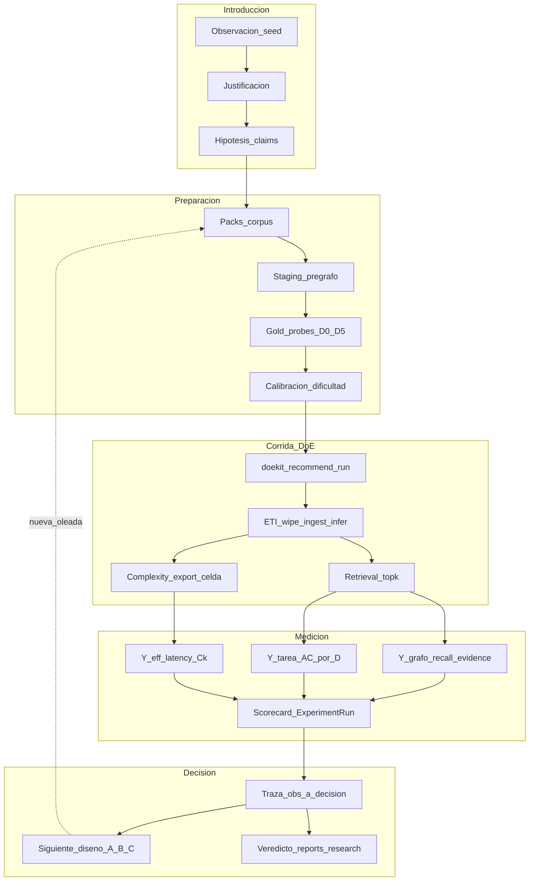

# Experimental Design — Ungraph ETI

**Capa ZEN:** `experiment/` — **único** documento de contexto de diseño experimental (hipótesis, justificación, planilla de lo hecho, traza observación→decisión, diseños siguientes).  
**Audiencia:** research + developer.  
**Última revisión:** 2026-08-11  
**Rama:** `feature/research-eti-complexity`  
**Operativa / oleadas:** [`RESEARCH_TRACK.md`](RESEARCH_TRACK.md) · **Gates seed / checklist A–E:** [`PLAN_MAESTRO.md`](PLAN_MAESTRO.md) · **How-to DoE:** [`BENCHMARK_ETI_DOMAINS.md`](BENCHMARK_ETI_DOMAINS.md) · **Fundamento $C_k$:** [`../research/COMPLEXITY_UNSTRUCTURED.md`](../research/COMPLEXITY_UNSTRUCTURED.md)

| | |
|--|--|
| **is** | Seed mono-doc medido; H_I PASS (grafo); AC saturado; instrumentación DoE/runner cerrada; este diseño recopila la traza y fija el programa siguiente. |
| **will be** | Packs multicorpus + staging; probes D0–D5 calibrados; DoE multidoc; $C_k$ por celda; Y de tarea discriminativa. |
| **Open claims** | § Hipótesis / claims. Seed ≠ PRODUCT §5. |

**Alcance de este archivo:** solo diseño experimental. No es API, ni guía de uso, ni validación de producto. Números viven en `benchmarks/domains/…/reports/`; promoción a [`../validation/`](../validation/) solo bajo PRODUCT §5.

---

## 1. Introducción — pipeline de trabajo experimental

El ciclo es cerrado: observar → diseñar → correr (doekit) → medir Y desagregadas (+ $C_k$) → decidir el siguiente factor o gold. No se reabre el cierre técnico A+B del PLAN salvo regresión.



**Lectura del diagrama:** la calibración de probes (D0–D5) es puerta antes del DoE barrido; la complejidad no es un apéndice — sale en cada celda junto al scorecard.

---

## 2. Justificación — por qué este diseño (y no otro)

| Problema observado | Por qué importa | Respuesta de diseño |
|--------------------|-----------------|---------------------|
| AC@k ≈ 1.0 con ET y ETI | La Y de **tarea** no discrimina arquitecturas | Taxonomía D0–D5 + calibración obligatoria antes de DoE |
| Gold anclado a un doc seed | No hay señal de razonamiento **multidocumento** | Packs multicorpus + probes con `docs_required` |
| Facts = recall + provenance | No medimos si el fact **sirve** para hops / inter-doc | `fact_support@probe`, path_hit, ablación por doc |
| $C_k$ solo como export suelto | Complejidad no explica error por configuración | $C_k$ covariable **por celda** (Diseño C) |
| Re-Extract en cada celda | Coste e irreproducibilidad | Staging pre-grafo versionado (chunks/emb/recipe) |
| `composite_score` con R²≈1 (N=8) | Sobreinterpreta screening offline | Veredicto solo con Y desagregadas / estratificadas |

El cierre del [`PLAN_MAESTRO.md`](PLAN_MAESTRO.md) (seed + A+B) queda como **base instrumental**. Este diseño es el programa científico **después** de ese cierre: mejorar el instrumento de medición y aterrizar lo que faltó.

---

## 3. Hipótesis (claims falseables)

Formato único: enunciado → predicción → falsación → artefacto.

### H1 — `H_I` seed (grafo) — **MEDIDO PASS** (no §5)

- **Enunciado:** Con Transform fijo, `ner` > `none` en recall de entidades ancladas y la tarea no colapsa.  
- **Evidencia:** `hi_wave_verdict.json` (entity_recall 0→~0.47; AC@k=1.0 ambos).  
- **Límite:** no implica PRODUCT §5 ni superioridad en QA.

### H2 — `H_chunk_task_Y` — **MEDIDO DÉBIL / OPEN**

- **Enunciado:** Con Infer fijo, chunking mueve Y de **tarea**.  
- **Evidencia seed:** AC no retiene factores; latency sí (`chunk_size`).  
- **Decisión:** no reabrir hasta probes calibrados (H4).

### H3 — Familias Infer — **COMPARED**

- **Enunciado:** ≥2 familias comparables bajo mismas Y de Capa 0.  
- **Evidencia:** `family_wave_verdict.json` (`ner` vs `pattern`); deltas descriptivos, AC saturado.

### H4 — `H_probe_calibration` — **OPEN**

- **Enunciado:** Set D0–D5 con ≥30% D2+ (y ≥20% D3+ en pack multi) logra media AC@k < 0.9 bajo ET (`inference=none`).  
- **Falsación:** tras dos curaciones, media ET ≥ 0.9 → cambiar gold/corpus.  
- **Artefacto:** `reports/research/multicorpus/probe_calibration.json`.

### H5 — `H_multi_doc_reasoning` — **OPEN**

- **Enunciado:** En pack multi, AC@D3+ < AC@D1 a igual arquitectura; Infer mejora soporte de facts/paths frente a `none` sin tumbar D1.  
- **Falsación:** D3≈D1 en todas las arquitecturas → pack/probes no exigen cruce real.  
- **Protocolo:** Diseño B.

### H6 — `H_I_seed_vs_product` — **OPEN** (PLAN)

- **Enunciado:** PASS seed no implica §5 hasta confrontar pack multi y/o 2º dominio con el mismo protocolo.  
- **Protocolo:** Diseño B / `--hi-wave` comparable.

### H7 — `H_bridge_complexity` — **OPEN condicional**

- **Enunciado:** $C_k$ por celda predice error en D3–D4 mejor que azar (≥1 pack multi).  
- **Activar analyze cuando:** packs + probes calibrados + export por celda.  
- **Falsación:** correlación nula/negativa estable → acotar F5.

---

## 4. Planilla de lo realizado

Una sola tabla viva: qué corrimos, qué vimos, estado. Actualizar al cerrar oleadas (no inventar filas “hechas”).

| ID | Qué se hizo | Dominio / artefacto | Y / hallazgo clave | Estado | Fecha |
|----|-------------|---------------------|--------------------|--------|-------|
| R1 | Instrumentación ExperimentRun + doekit + runner offline/online | `ungraph/evaluation/`, CI `eti-measurable` | Contrato de corrida usable | **hecho** | 2026-08 |
| R2 | Oleada H_I online (`none` vs `ner`) | `hi_wave_verdict.json` | Recall 0→0.47; AC=1.0 ambos | **hecho (seed)** | 2026-08-10 |
| R3 | Capa 0 freeze + reload | `capa0_artifact.json`, `reload_verdict.json` | Recipe congelable | **hecho** | 2026-08 |
| R4 | Oleada familias `ner` vs `pattern` | `family_wave_verdict.json` | Pattern ↑ recall; AC saturado | **hecho (seed)** | 2026-08 |
| R5 | DoE H_chunk (Infer fijo) | `results_h_chunk.csv`, `analysis_h_chunk*.json` | AC débil; latency retiene `chunk_size` | **hecho (débil)** | 2026-08 |
| R6 | Cierre loop seed | `pipeline_closure.json` | MVP medible seed cerrado | **hecho** | 2026-08 |
| R7 | Screening offline composite | `analysis.json` | R²=1 / todos retenidos — **no usar como veredicto** | **hecho (caveat)** | 2026-08 |
| R8 | Cierre técnico A+B + PLAN checklist | `main` / PLAN | Settings, CLI, reasoning API, CI NER | **hecho** | 2026-08-11 |
| R9 | Scaffold research + `complexity_export` | rama research, NB-01…04 | Bridge F5 portable; no por celda aún | **hecho (scaffold)** | 2026-08-11 |
| R10 | Packs / staging / gold D0–D5 | — | — | **pendiente** | — |
| R11 | Calibración probes (Diseño A) | — | — | **pendiente** | — |
| R12 | DoE multicorpus + $C_k$ por celda (B+C) | — | — | **pendiente** | — |

---

## 5. Traza observación → decisión

Plantilla fija: **Observación** → **Interpretación** → **Decisión de diseño** → **Siguiente ID**.

| # | Observación | Interpretación | Decisión | Lleva a |
|---|-------------|----------------|----------|---------|
| T1 | AC@k=1.0 en `none` y `ner` (H_I) | Examen de tarea demasiado fácil (AC saturado) | No usar AC seed como prueba de Infer; endurecer probes | H4, Diseño A |
| T2 | `entity_recall` sí discrimina ET vs ETI | Infer aporta al **grafo anclado** | Mantener recalls + evidence como Y de Capa 0 | H1 cerrado seed; extender a multi-doc |
| T3 | H_chunk: AC sin factores retenidos; latency sí | Chunking mueve presupuesto, no tarea en seed fácil | Aparcar H2 hasta calibración | H4 → luego reabrir H2 |
| T4 | Offline composite R²≈1, N=8 | Sobreajuste / Y poco informativa | Prohibir composite como gate | Diseños A–C: Y desagregadas |
| T5 | Manifest con varios papers; gold solo seed | Corpus listado ≠ batería experimental | Introducir **packs** + gold por pack | H5, R10 |
| T6 | Re-ingest completo por celda (coste) | Impide iterar DoE y complejidad | Staging pre-grafo versionado | R10, Diseño C |
| T7 | Facts = cobertura, no utilidad de camino | No medimos razonamiento multi-hop/inter-doc | Añadir fact_support / path_hit / ablación | H5 métricas |
| T8 | Complejidad exportable pero suelta | F5 no explica configs | $C_k$ en cada `ExperimentRun` | H7, Diseño C |
| T9 | PLAN A–E cerrado | Ingeniería lista; ciencia §5 abierta | Este doc = único contexto de diseño post-cierre | Programa P1… |

*(Añadir filas T10+ al obtener `probe_calibration` o results multi — no anticipar resultados.)*

---

## 6. Marco de dificultad de probes (instrumento)

**Difícil ≠ “suena técnica”.** Difícil = camino de evidencia que el sistema puede fallar de forma controlada.

| Nivel | Nombre | Definición operativa | Fallo típico |
|-------|--------|----------------------|--------------|
| **D0** | Lexical | Respuesta local; overlap alto | Casi nunca (satura) |
| **D1** | 1-hop | Una arista / un hecho en **un** doc | Infer o retrieval local |
| **D2** | Multi-hop intra-doc | ≥2 hechos en el mismo doc | Chunking rompe cadena |
| **D3** | Multi-hop inter-doc | Encadenar ≥2 docs del pack | Sin puente inter-doc |
| **D4** | Inter-grafo / contexto | Cruzar subgrafos o desambiguar | Entidad/contexto erróneo |
| **D5** | Contraste / negación | Excluir distractor en top-k | Falso containment |

**Gate de calibración (antes de DoE barrido):** etiquetar `difficulty`, `hop_count`, `docs_required[]`, `evidence_span_ids[]`; baseline ET+ETI; aceptar set solo si D0≤30%, media AC ET<0.9, ≥30% D2+, y si pack multi ≥20% D3+.

---

## 7. Artefactos de diseño (packs, staging, DoE)

### 7.1 Packs y staging (pre-grafo)

```text
benchmarks/domains/knowledge_graphs/
  corpus/
  packs/
    pack_seed.yaml
    pack_kg_multi_v1.yaml          # will be
  staging/<doc_id>/
    chunks.jsonl
    embeddings.npy
    transform_meta.json
    pattern_ref.yaml
  gold/
    gold_seed.json                 # hoy: gold.json
    gold_pack_kg_multi_v1.json
  reports/research/multicorpus/
```

### 7.2 Diseños doekit

| Diseño | Objetivo | Factores / fijo | Y |
|--------|----------|-----------------|---|
| **A** Calibración | Gate H4 | Pack fijo; Infer `none`/`ner` | AC por D-level |
| **B** Multidoc × Infer | H5 / H6 | `corpus_pack` × `inference` × `rag` × `top_k` | AC@D*, recalls, fact_support |
| **C** Complejidad a la par | H7 | Misma celda que B (+ H_chunk si se reabre) | $C_k$ + correlación vs error D3–D4 |

Wipe Neo4j entre celdas online. Infer = slot. **No** composite como veredicto.

### 7.3 Utilidad de Facts (ampliación)

| Criterio | Pregunta | Métrica | Estado |
|----------|----------|---------|--------|
| Cobertura | ¿Concepto/par en $G$? | entity/relation recall | **is** |
| Anclaje | ¿Provenance? | evidence_coverage | **is** |
| Soporte probe | ¿Fact del camino en $G$? | fact_support@probe | will be |
| Path | ¿Path D2/D3? | path_hit | will be |
| Marginal | ¿Ablación por doc tumba D3? | ΔAC | will be |

---

## 8. Pasos a seguir (consecuencia)

```text
P0  Este documento + enlaces canon                         ← hecho
P1  Spec packs/staging + pack_seed / pack_kg_multi_v1
P2  Gold D0–D5 + docs_required + evidence spans
P3  Diseño A → probe_calibration.json (+ filas T/R)
P4  Runner --pack + load staging (skip Extract opcional)
P5  complexity_export → columna por ExperimentRun
P6  Diseño B online → reports/research/multicorpus/
P7  Notebooks + plots Y×D×pack×C_k
P8  multicorpus_wave_verdict.json; actualizar planilla §4–5
P9  2º dominio / §5 solo con Y discriminativas
```

**Stop line:** no Capa 2 (agentes) en A–C; no pisar veredictos seed; no afirmar §5 desde seed.

---

## 9. Punteros (fuera de este contexto)

| Doc | Rol (no duplicar aquí) |
|-----|-------------------------|
| [`PLAN_MAESTRO.md`](PLAN_MAESTRO.md) | Checklist A–E cerrado; gates seed |
| [`RESEARCH_TRACK.md`](RESEARCH_TRACK.md) | Oleadas / comandos de la rama |
| [`BENCHMARK_ETI_DOMAINS.md`](BENCHMARK_ETI_DOMAINS.md) | Cómo ejecutar doekit |
| [`ROADMAP_LEVEL_C.md`](ROADMAP_LEVEL_C.md) | Horizonte C (no bloquea este diseño) |

---

*Único lienzo de diseño experimental. Actualizar §4 planilla y §5 traza al cerrar P3/P6/P8; no anticipar resultados no medidos.*
