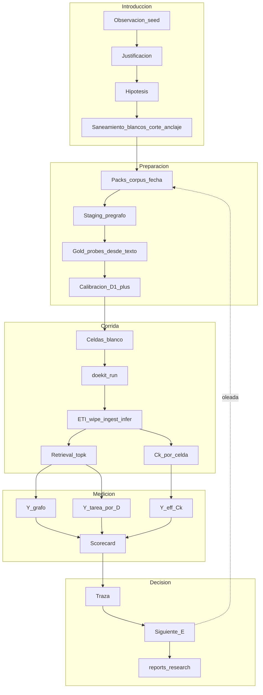

# Experimental Design — Ungraph ETI

**Capa ZEN:** `experiment/` — **único** documento de contexto de diseño experimental (hipótesis, justificación, planilla, traza, saneamiento, sección de experimentos).  
**Audiencia:** research + developer.  
**Última revisión:** 2026-08-11  
**Rama:** `feature/research-eti-complexity`  
**Operativa:** [`RESEARCH_TRACK.md`](RESEARCH_TRACK.md) · **PLAN seed:** [`PLAN_MAESTRO.md`](PLAN_MAESTRO.md) · **DoE how-to:** [`BENCHMARK_ETI_DOMAINS.md`](BENCHMARK_ETI_DOMAINS.md) · **$C_k$:** [`../research/COMPLEXITY_UNSTRUCTURED.md`](../research/COMPLEXITY_UNSTRUCTURED.md)

| | |
|--|--|
| **is** | Seed mono-doc medido; H_I PASS (grafo); AC saturado; instrumentación cerrada; reglas de saneamiento (blancos, anclaje textual, corte LLM) **documentadas**; scaffold `packs/` iniciado. |
| **will be** | Packs multicorpus + staging; probes D1+ anclados al texto; DoE con blancos; comparación pre/post-corte LLM; $C_k$ por celda. |
| **Open claims** | §3. Seed ≠ PRODUCT §5. |

**Alcance:** solo diseño experimental. Resultados en `benchmarks/domains/…/reports/`; `validation/` solo bajo PRODUCT §5.

---

## 1. Introducción — pipeline de trabajo experimental

Ciclo: observar → sanear (blancos + anclaje + corte) → packs/staging/gold → calibrar → DoE → Y desagregadas (+ $C_k$) → traza → siguiente diseño.



---

## 2. Justificación

| Problema | Respuesta de diseño |
|----------|---------------------|
| AC saturado / preguntas triviales | Probes **desde el texto**; excluir D0 trivia; calibración D1+ |
| Paper famoso + LLM de Infer/juez | Contaminación de preentrenamiento → corte temporal + blancos LLM |
| Gold mono-doc | Packs multicorpus + `docs_required` |
| Re-Extract por celda | Staging pre-grafo |
| Composite R²≈1 | Solo Y desagregadas / estratificadas |
| Complejidad suelta | $C_k$ por celda |

---

## 3. Hipótesis (claims falseables)

### H1 — `H_I` seed (grafo) — **MEDIDO PASS** (no §5)

Recall 0→~0.47; AC=1.0 ambos. No implica QA ni §5.

### H2 — `H_chunk_task_Y` — **DÉBIL / OPEN**

Reabrir solo tras probes calibrados (H4).

### H3 — Familias Infer — **COMPARED**

`ner` vs `pattern`; AC saturado.

### H4 — `H_probe_calibration` — **OPEN**

Media AC@k ET < 0.9; D0≤10% del set de **evaluación** (D0 solo como blanco); ≥30% D2+; pack multi ≥20% D3+.  
**Artefacto:** `reports/research/multicorpus/probe_calibration.json`.

### H5 — `H_multi_doc_reasoning` — **OPEN**

AC@D3+ < AC@D1; Infer mejora support/path vs `none`.

### H6 — `H_I_seed_vs_product` — **OPEN**

Pack multi y/o 2º dominio con mismo protocolo.

### H7 — `H_bridge_complexity` — **OPEN condicional**

$C_k$ predice error D3–D4 tras packs + calibración + export por celda.

### H8 — `H_llm_contamination` — **OPEN**

- **Enunciado:** Con corpus **pre-corte** del modelo, `inference=llm` mejora Y de grafo/tarea respecto a `ner` **más** que con corpus **post-corte** (o doc held-out), a igual anclaje.  
- **Interpretación:** si el delta pre≫post, hay aprovechamiento de conocimiento paramétrico (trampa relativa).  
- **Control:** mismas probes ancladas a spans; solo cambia `published_at` del pack / doc.  
- **Falsación:** deltas indistinguibles pre/post → contaminación no detectable con este instrumento (o ausente).  
- **Artefacto:** `reports/research/multicorpus/llm_cutoff_wave.json`.

---

## 4. Saneamiento experimental (obligatorio)

### 4.1 La pregunta debe venir del texto

| Regla | Detalle |
|-------|---------|
| **Anclaje** | Todo probe declara `answer_span` / `evidence_span_ids` en el/los doc(s) del pack |
| **No trivia** | Prohibido como Y de evaluación: hechos de cultura general del dominio (“Neo4j usa Cypher”) sin span único en el corpus |
| **Parafraseo local** | Preferir wording del documento (cifras, definiciones locales, cruces D3) |
| **D0** | Solo como **blanco** de saturación; no cuenta para el gate H4 de “set aceptado” |
| **La pregunta influye** | Mismo grafo + probes malos ⇒ conclusiones falsas; calibrar probes **antes** de barrer arquitectura |

### 4.2 Contaminación LLM y fecha de corte

Si el LLM se entrenó con un paper del pack, medir Infer LLM (o juez LLM) **sin controles es trampa relativa**: parece ETI anclado y es memoria paramétrica.

| Mecanismo | Uso |
|-----------|-----|
| `published_at` / `cutoff_class` por documento | `pre_cutoff` \| `post_cutoff` \| `unknown` \| `held_out` (reescrito/privado) |
| `model_cutoff` en la corrida | Fecha de corte declarada del modelo (p.ej. API card); si unknown → LLM solo en oleada contaminable |
| Pack `pre` vs pack `post` | Misma taxonomía de probes; distinto régimen temporal |
| Anclaje span | Fact LLM sin provenance a chunk → **no** entra en Y de grafo |

**Diseño B (limpio):** `inference ∈ {none, ner, pattern}` — veredicto principal.  
**Diseño B′ (contaminable):** añade `llm` + factor `cutoff_class`; **nunca** mezclar B′ en el gate H1/H5 sin etiquetar.

### 4.3 Blancos (controles)

Toda oleada de experimentos incluye celdas blanco. Sin blanco, no se interpreta el tratamiento.

| ID blanco | Condición | Qué debe pasar | Si no pasa |
|-----------|-----------|----------------|------------|
| **W0** | `inference=none` | Recall entidades ~0 o muy bajo; AC solo si probes fáciles | Instrumento roto / gold leak |
| **W1** | Probes D0 only | AC@k ≈ 1.0 (documenta saturación) | — |
| **W2** | Probes D3+ con pack **seed mono-doc** | AC@D3 debe ser bajo o N/A (no hay 2º doc) | Probes mal etiquetados |
| **W3** | Shuffle / respuesta de otro doc | AC debe caer | Containment/fuga en eval |
| **W4** | LLM + pack `post_cutoff` o `held_out` | No debe igualar milagro pre-corte sin ancla | Contaminación o overfit eval |
| **W5** | Top-k=1 + probe D2+ | AC baja vs top-k alto (si retrieval importa) | Y no usa retrieval |

---

## 5. Planilla de lo realizado

| ID | Qué se hizo | Artefacto | Hallazgo | Estado | Fecha |
|----|-------------|-----------|----------|--------|-------|
| R1 | Instrumentación DoE/runner | `ungraph/evaluation/` | Contrato usable | **hecho** | 2026-08 |
| R2 | H_I online | `hi_wave_verdict.json` | Recall↑; AC saturado | **hecho seed** | 2026-08-10 |
| R3 | Capa 0 freeze | `capa0_artifact.json` | Recipe congelable | **hecho** | 2026-08 |
| R4 | Familias ner/pattern | `family_wave_verdict.json` | Pattern↑ recall; AC=1 | **hecho seed** | 2026-08 |
| R5 | H_chunk | `analysis_h_chunk*.json` | AC débil; latency←chunk_size | **débil** | 2026-08 |
| R6 | Cierre seed | `pipeline_closure.json` | Loop cerrado | **hecho** | 2026-08 |
| R7 | Offline composite | `analysis.json` | No usar como gate | **caveat** | 2026-08 |
| R8 | Cierre técnico A+B | PLAN | Librería operable | **hecho** | 2026-08-11 |
| R9 | Research scaffold + C_k export | NB-01…04 | Bridge F5 | **scaffold** | 2026-08-11 |
| R10 | Saneamiento + packs scaffold | este doc + `packs/` | Reglas blancos/corte/anclaje | **en curso** | 2026-08-11 |
| R11 | Calibración probes (E1) | — | — | **pendiente** | — |
| R12 | DoE B/B′ + C_k (E2+) | — | — | **pendiente** | — |

---

## 6. Traza observación → decisión

| # | Observación | Decisión | Lleva a |
|---|-------------|----------|---------|
| T1 | AC=1.0 none y ner | No usar AC seed como prueba de Infer | H4, §4.1 |
| T2 | Recall discrimina ET/ETI | Y de grafo se mantiene | H1; multi-doc |
| T3 | H_chunk: AC plano | Aparcar H2 | H4→H2 |
| T4 | Composite R²≈1 | Prohibir composite-gate | §10 |
| T5 | Papers en manifest, gold seed | Packs + gold por pack | E0 |
| T6 | Re-ingest caro | Staging | E0 |
| T7 | Facts sin utilidad de camino | fact_support / path | H5 |
| T8 | C_k suelto | Por celda | H7 |
| T9 | PLAN cerrado | Este doc = diseño post-cierre | §10 |
| T10 | LLM + paper público = posible trampa | Corte + B limpio vs B′; anclaje span | H8, W4 |
| T11 | Preguntas triviales saturan | Probe desde texto; D0 solo blanco | §4.1, W1 |

---

## 7. Marco de dificultad (instrumento)

| Nivel | Nombre | Definición | Uso |
|-------|--------|------------|-----|
| **D0** | Lexical / trivia | Overlap alto; respuesta “de dominio” | Solo blanco W1 |
| **D1** | 1-hop | Un hecho **en el texto** de un doc | Evaluación |
| **D2** | Multi-hop intra-doc | ≥2 spans mismo doc | Evaluación |
| **D3** | Multi-hop inter-doc | ≥2 docs | Evaluación pack multi |
| **D4** | Inter-grafo / contexto | Desambiguar / cruzar subgrafos | Evaluación |
| **D5** | Contraste | Excluir distractor en top-k | Evaluación |

**Campos obligatorios del probe:** `query`, `answer`, `difficulty`, `hop_count`, `docs_required[]`, `answer_span` o `evidence_span_ids[]`, `from_text: true`.

---

## 8. Artefactos — packs, staging, fechas

```text
benchmarks/domains/knowledge_graphs/
  corpus/
  packs/
    pack_seed.yaml
    pack_kg_multi_v1.yaml       # will be
    README.md
  staging/<doc_id>/             # will be poblado
  gold/
    README.md
  reports/research/multicorpus/
```

**Metadatos por documento (pack):**

```yaml
id: graphrag_edge
path: corpus/2404.16130_graphrag.md
published_at: 2024-04-01   # aproximado arXiv
cutoff_class: post_cutoff  # relativo a model_cutoff de la corrida
```

Clasificación `cutoff_class` se **resuelve en corrida** frente a `model_cutoff` declarado; en el pack se guarda `published_at`.

---

## 9. Diseños doekit (sanos)

| Diseño | Objetivo | Factores | Blancos |
|--------|----------|----------|---------|
| **A** Calibración | H4 | Pack fijo; `none`/`ner` | W0, W1, W3 |
| **B** Limpio | H5/H6 | pack × {none,ner,pattern} × rag × top_k | W0, W2, W5 |
| **B′** Contaminable | H8 | B + `llm` + régimen pre/post corte | W4 |
| **C** Complejidad | H7 | Misma celda B/B′ | — ($C_k$ covariable) |

Wipe entre celdas online. **Veredicto principal = B + A.** B′ se reporta aparte.

---

## 10. Sección de experimentos (orden de ejecución)

Empezar **solo** tras §4. No saltar a B′ antes de blancos y anclaje.

### E0 — Scaffold packs + metadatos de fecha — **EN CURSO**

- [x] Documentar saneamiento (§4) y H8.  
- [x] Crear `packs/pack_seed.yaml` + README.  
- [ ] `pack_kg_multi_v1.yaml` con `published_at` por doc.  
- [ ] Directorio `staging/` listo para poblar.  
- **Salida:** estructura versionada; sin claims nuevos.

### E1 — Gold anclado + blancos W0/W1/W3 (calibración)

- Reescribir/etiquetar probes: `from_text`, spans, D1+; D0 solo set blanco.  
- Correr W0 (`none`), W1 (D0), W3 (shuffle).  
- **Gate:** media AC ET en set evaluación < 0.9.  
- **Salida:** `probe_calibration.json` + filas R11/T nuevas.

### E2 — Diseño B limpio (multidoc cuando exista pack multi)

- Factores sin `llm`. Incluir W0/W2/W5.  
- Y: AC@D*, recalls, evidence.  
- **Salida:** `results_multi.csv` / analysis por Y.

### E3 — Diseño B′ (corte LLM) — opcional tras E2

- Packs/docs pre vs post `model_cutoff`.  
- Comparar delta llm−ner en pre vs post.  
- **Salida:** `llm_cutoff_wave.json` (H8).

### E4 — Diseño C ($C_k$ por celda)

- Export en cada run_id de E2/E3.  
- Correlación exploratoria vs error D3–D4.

### E5 — Veredicto de oleada

- `multicorpus_wave_verdict.json`; actualizar planilla §5 y traza §6.

```text
E0 → E1 (gate calibración) → E2 (B limpio) → E4 (Ck)
                         ↘ E3 (B′ corte) solo etiquetado
                         → E5 veredicto
```

---

## 11. Pasos P (mapa a E)

```text
P0  Diseño + saneamiento                         ← hecho
P1  Packs/staging scaffold                       ← E0 en curso
P2  Gold from_text + D1+                         ← E1
P3  Calibración + blancos W0/W1/W3               ← E1
P4  Runner --pack / staging                      ← habilita E2
P5  C_k por ExperimentRun                        ← E4
P6  DoE B limpio                                 ← E2
P7  Plots / notebooks
P8  Veredicto                                    ← E5
P9  §5 / 2º dominio solo con Y sanas
P10 DoE B′ corte LLM                             ← E3
```

**Stop line:** no agentes Capa 2; no pisar seed; no mezclar B′ en gates limpios; no probes sin span; no afirmar §5.

---

## 12. Punteros

| Doc | Rol |
|-----|-----|
| [`PLAN_MAESTRO.md`](PLAN_MAESTRO.md) | A–E cerrado |
| [`RESEARCH_TRACK.md`](RESEARCH_TRACK.md) | Oleadas / comandos |
| [`BENCHMARK_ETI_DOMAINS.md`](BENCHMARK_ETI_DOMAINS.md) | Cómo correr doekit |
| [`../../benchmarks/domains/knowledge_graphs/packs/`](../../benchmarks/domains/knowledge_graphs/packs/) | Packs E0 |

---

*Actualizar §5–§6 y checkboxes §10 al cerrar cada E; no anticipar resultados no medidos.*
