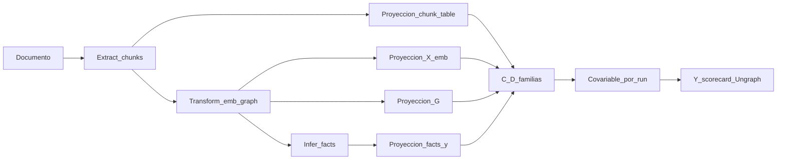

# Complejidad en datos no estructurados — fundamento (antes de código)

> **Estado:** memo de fundamento (F5). Sin adaptadores ni claims experimentales.  
> **Rama:** `feature/complexometría-unstructured`  
> **Issue canónico (instrumento):** repo hermano `Data-Complexity-Representations`, ruta  
> `project/future/ISSUE_ETI_UNSTRUCTURED_BRIDGES.md` (p. ej. `D:/projects/Data-Complexity-Representations/...`).  
> **Notas origen:** `article/ETI/EXTRACT-TRANSFORM-INFER.md` (gitignored) · índice plan: [`PLAN_MAESTRO.md`](../experiment/PLAN_MAESTRO.md) § Complexometrum

---

## 1. Pregunta que respondemos

**No:** «¿cuán complejo es este PDF?»  
**Sí:** después de proyectar un corpus por ETI a representaciones medibles, ¿qué tan difícil / estructurada / inferible es esa representación, y predice eso el error de Infer o de tarea?

La complejidad de lo no estructurado no es una propiedad intrínseca de los bytes del corpus; es una propiedad de **pares (proyección, tarea opcional)**. Ungraph aporta los proyectores; Complexometrum diagnostica la proyección.

---

## 2. Objetos medibles (no mezclar)

| Objeto | Pregunta legítima | No es |
|--------|-------------------|-------|
| Documento crudo | tamaño, idioma, ruido OCR | $C(D)$ tabular |
| Chunks | partición, solape, densidad léxica | «calidad semántica» sin $Y$ |
| Embeddings $X_{\mathrm{emb}}\in\mathbb{R}^{n\times d}$ | geometría / $d_{\mathrm{eff}}$ / entrenabilidad en esa proyección | complejidad del significado absoluto |
| Grafo léxico/KG $G$ | topología, hubs, ruido de construcción | FCG de features tabulares |
| Facts (artefacto Infer) | inferibilidad, groundedness | complejidad del input solo |
| Tarea (QA / probes) | error observable $Y$ | diagnóstico de representación |

---

## 3. Formalismo

### 3.1 Núcleo Complexometrum v0.1 (tabular)

Sobre $D=(X,y)$ (o $X$ en exploración):

$$
C(D)=f\bigl(H(X),\,I(X;Y),\,d_{\mathrm{eff}},\,K(X),\,\mathrm{topo}(X)\bigr)
$$

con

$$
d_{\mathrm{eff}}=\frac{\bigl(\sum_i\lambda_i\bigr)^2}{\sum_i\lambda_i^2}
$$

(eigenvalores de la covarianza de $X$). En código: `composite_complexity` agrega familias clásica / cuántica / topológica. El FCG es representación *derivada* de dependencias entre features, no un sexto argumento libre de $f$ en v0.1.

Referencia teórica local del instrumento: `Data-Complexity-Representations/project/docs/ES/03_Complejidad_de_Datos.md`.

### 3.2 Complejidad inducida por proyección

Sea $U$ un artefacto no estructurado (documento / corpus). Definimos proyectores $\Pi_k$ a dominios donde $C$ ya es legítimo:

| $\Pi$ | Codominio | Rol |
|-------|-----------|-----|
| $\Pi_{\mathrm{chunk}}$ | tabla de features de chunks | morfología de partición |
| $\Pi_{\mathrm{emb}}$ | $X_{\mathrm{emb}}\in\mathbb{R}^{n\times d}$ | geometría del Transform |
| $\Pi_{G}$ | grafo (léxico / co-oc / KG) | topología no-FCG |
| $\Pi_{\mathrm{fact}}$ | features de facts + $y\in\{\mathrm{grounded},\mathrm{ungrounded}\}$ | complejidad del *output* Infer |

$$
C_k(U;\,\theta) \;:=\; C\bigl(\Pi_k(U;\,\theta)\bigr)
$$

donde $\theta$ son factores ETI (`chunk_size`, encoder, `inference_mode`, …).

**Prohibición metodológica:** $C(\text{PDF bytes})$ no está definido; solo $C_k$.

### 3.3 Claims que el formalismo habilita

| ID | Claim | Rol de $C_k$ |
|----|--------|--------------|
| **H_T** | $\mathrm{corr}\bigl(C_{\mathrm{emb}}(U;\theta_T),\;\mathrm{error}_{QA}\bigr)$ significativo *antes* de variar Infer | predictor temprano de Transform |
| **H_bridge** | esa correlación estable en ≥2 corpora con el mismo adaptador | transferencia del instrumento |
| **H_I / H_chunk** | viven en Ungraph + DoE | $C_k$ es **covariable**, no veredicto de arquitectura |

Separación: diagnóstico de representación ($C_k$) ≠ comparar arquitecturas ETI (`DomainScorecard`).

---

## 4. Cómo aprovechar lo existente

| Ya existe | Uso en el puente |
|-----------|------------------|
| `Complexometrum.composite_complexity(X, y)` | No tocar DoD tabular; alimentar con $X=\Pi(U)$ |
| Familias clásica / cuántica / topológica | Reutilizar sobre embeddings; en fase B sobre grafos exportados |
| Cortes ETI Ungraph (chunks, Neo4j, facts, scorecard) | Banco: exportar matrices/grafos por `run_id` |
| doekit | Screening de factores de *proyección* |
| Data-Complexity-To-Graph-Study | Referencia conceptual fase B; no acoplar API |

### Fases del instrumento (issue canónico)

1. **A — Adaptadores de proyección (MVP):** `from_embeddings` / `from_chunk_table`.  
2. **B — Grafo no-FCG:** métricas sobre grafo léxico/KG exportado.  
3. **C — Inferibilidad:** complejidad del artefacto Infer (facts + groundedness).  
4. **D — Docs + DoE** de representación.

**Gobernanza de repos:** adaptadores viven en **Complexometrum**; Ungraph valida correlación con $Y$ y, si sobrevive H_bridge, el diseño vuelve como feature. Esta rama Ungraph es banco experimental, no el hogar definitivo de `composite_complexity`.

---

## 5. Fundamento epistemológico

1. **DIKW operativo.** Lo no estructurado no es «datos peores»; es información sin forma medible. E→T construye la forma; I propone conocimiento. Complejidad se mide en la forma.

2. **Representacionalismo instrumental.** No afirmamos complejidad semántica absoluta. Afirmamos que ciertas proyecciones hacen *predecible* el fracaso/acierto de Infer/tarea. Si no predicen, el instrumento se recorta (H_bridge).

3. **Falsacionismo sobre narrativa ETI.** Las notas origen mezclan ontología, embeddings y verdad Popperiana. El puente las desarma en hipótesis discriminables; el criterio es supervivencia en screening DoE.

4. **Separación de roles.** Complexometrum: *qué tan difícil es esta representación*. Ungraph scorecard: *qué tan bien cumplió la arquitectura la tarea*. Sin eso, $C(D)$ rivaliza al scorecard y pierde poder diagnóstico.

5. **Economía del loop.** Si $C_k$ predice error temprano (H_T), se puede elegir Transform antes de gastar Infer caro.

6. **Límite honesto.** El seed KG satura $Y$ de tarea; hace falta variación (más dominios / deuda G). Sin variación en $Y$, H_T/H_bridge son indecidibles aunque $C_k$ esté bien implementado.

---

## 6. Gate de ejecución (Fase A) — **MVP cerrado**

| Gate | Estado | Evidencia |
|------|--------|-----------|
| Memo | ✅ | este documento |
| Y multi-grafo | ✅ runner | `rag-wave` online COMPARED (`rag_wave_verdict.json`) |
| Fase A instrumento | ✅ | `complexometrum.adapters.from_embeddings` / `from_chunk_table` |
| Export Ungraph | ✅ | `ungraph.evaluation.complexity_export.export_chunk_embeddings` |

**Pendiente (siguiente rama / oleada):** H_bridge empírico ($C_{\mathrm{emb}}$ vs error QA en ≥2 corpora); Fase B grafo no-FCG; PageRank GDS.

**No mezclar:** calibración $\tau$ tabular; meter Complexometrum dentro de `ingest_document`.

---

## 7. Referencias

- [`PLAN_MAESTRO.md`](../experiment/PLAN_MAESTRO.md) — § Complexometrum, checklist F5  
- [`ROADMAP_LEVEL_C.md`](../experiment/ROADMAP_LEVEL_C.md) — oleada opcional puente  
- [`BENCHMARK_ETI_DOMAINS.md`](../experiment/BENCHMARK_ETI_DOMAINS.md) — scorecard / DoE  
- Complexometrum: `Data-Complexity-Representations/project/docs/ES/03_Complejidad_de_Datos.md`  
- Issue puente: `Data-Complexity-Representations/project/future/ISSUE_ETI_UNSTRUCTURED_BRIDGES.md`  
- Notas ETI (local, gitignored): `article/ETI/EXTRACT-TRANSFORM-INFER.md`
